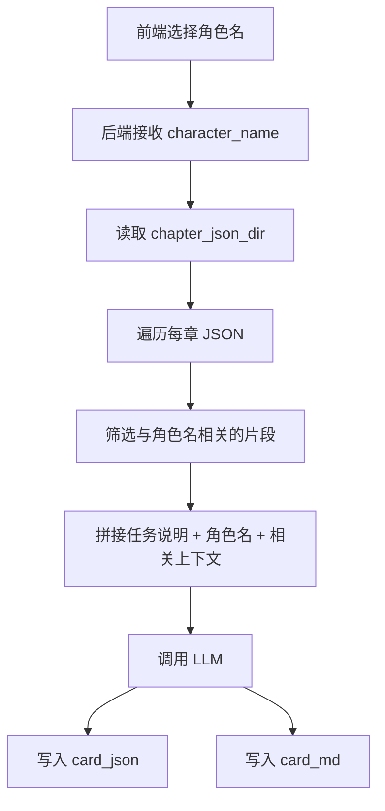

# CharPick Card 提取结构与 Prompt 拼接说明

本文档专门说明 **card 提取** 的结构，以及它是如何把 prompt 和逐章 JSON 拼接起来的。

当前 card 的设计原则是：

- 前端先从 summary 中看到可选人物。
- 用户选择一个角色名，例如 `石野`。
- 后端接收角色名后，读取逐章提取结果。
- 后端只找出与该角色相关的章节片段。
- 再把这些片段与 `card_prompts` 拼接后交给 LLM 生成角色卡。

这里 card **不依赖 summary 的最终成品** 来生成，而是直接基于逐章 JSON 来做角色卡提取。

## 1. card 的输入结构

当前 card 命令的关键输入有三个：

- `chapter_json_dir`：逐章提取结果目录。
- `source_file_id`：源文件 ID，用于命名输出文件。
- `character_name`：目标角色名，例如 `石野`。

可选输入还有：

- `book_title`：书名或展示标题。
- `model`：指定使用的模型。
- `base_url`：Ollama 地址。
- `temperature`：采样温度。
- `timeout_seconds`：超时时间。

### 1.1 逐章 JSON 的基本结构

card 的输入目录中，每个文件对应一章，文件名通常类似：

- `sf_test_fullchain_002_chapter_0001.json`
- `sf_test_fullchain_002_chapter_0002.json`

每个章节 JSON 一般包含这些字段：

- `chapter_title`
- `chapter_info`
- `plot`
- `characters`
- `items`
- `world`

card 会从这些字段里找出与目标角色相关的片段。

## 2. card 的输出结构

card 输出会写到本地缓存目录中：

- `local_cache/<book>/card/card_json/`
- `local_cache/<book>/card/card_md/`

### 2.1 文件命名

输出文件名会包含角色名，且会做安全化处理。比如角色 `石野` 会输出类似：

- `sf_test_fullchain_002_石野_character_card.json`
- `sf_test_fullchain_002_石野_character_card.md`

### 2.2 输出 payload 结构

最终写出的 JSON 外壳结构大致如下：

```json
{
  "book_id": "sf_test_fullchain_002",
  "book_title": "test.txt",
  "dimension": "character_card",
  "character_name": "石野",
  "source_dir": "local_cache/test_sf_test_fullchain_002/extraction_json",
  "result": {
    "...": "LLM 返回的角色卡内容"
  }
}
```

真正的角色卡内容放在 `result` 里。

## 3. card prompt 是怎么拼接的

card 的 prompt 拼接由两部分组成：

1. 角色任务说明。
2. 逐章找回的角色相关片段。

### 3.1 任务级 prompt

当前 card 的配置放在：

- [backend/config.json](config.json)

card 目前使用的是：

- `card_prompts.character_card`

这个 prompt 负责告诉模型：

- 要生成什么类型的卡。
- 要重点输出哪些字段。
- 要做什么样的前端展示文案。

### 3.2 实际传给模型的 prompt 文本

在代码里，最终传给模型的 `prompt_description` 不是单独一个字符串，而是再加上角色名：

```text
角色名：石野
基于整本书或指定章节，生成可调用的角色展示卡：输出角色名称、简介、外形特征、性格标签、关键经历、常用台词、与其他角色关系，以及适合前端卡片展示的精简文案。若无相关信息则不要臆造。
```

也就是说，card 的 LLM 任务说明由两部分组成：

- 角色名前缀：`角色名：石野`
- 任务 prompt：来自 `card_prompts.character_card`

### 3.3 上下文文本是怎么拼的

card 的上下文由每章中与目标角色相关的片段拼接而成。

整体结构大致如下：

```text
【任务角色】石野
【任务说明】基于整本书或指定章节，生成可调用的角色展示卡：...
【上下文要求】仅依据每章中与目标角色相关的片段生成角色卡，不要引入无关人物或章节噪声。

【章节文件】sf_test_fullchain_002_chapter_0001.json
{
  "chapter_title": "...",
  "chapter_info": {...},
  "characters": {...}
}

【章节文件】sf_test_fullchain_002_chapter_0002.json
{
  "chapter_title": "...",
  "plot": {...},
  "characters": {...}
}
```

最终真正送去 LLM 的输入内容就是：

- 角色名
- card prompt
- 每章相关片段

## 4. card 是如何筛选每章片段的

card 不会把每章 JSON 全量塞给模型，而是先做角色匹配，再抽取对应字段。

### 4.1 角色匹配逻辑

代码会检查章节 JSON 中的这些内容是否包含目标角色名：

- 字符串值
- 字典里的嵌套字段
- 列表里的元素

只要某个片段能命中角色名，就会被保留。

### 4.2 card 会检查的章节字段

目前 card 会遍历这些字段：

- `chapter_info`
- `plot`
- `characters`
- `items`
- `world`

然后只保留其中与角色名相关的部分。

### 4.3 例子

如果角色名是 `石野`，而某章 `characters` 字段里有：

```json
{
  "characters": [
    {
      "name": "石野",
      "behavior": ["大喊"],
      "speech": ["我不信！"]
    }
  ]
}
```

那么这段会被保留并拼进 card 上下文。

如果某章里完全没有出现 `石野`，则该章一般不会进入最终上下文。

## 5. card 的调用入口

当前 card 命令是：

```bash
python -m backend.llm_dispatcher card --chapter-json-dir local_cache/test_sf_test_fullchain_002/extraction_json --source-file-id sf_test_fullchain_002 --book-title test.txt --character-name 石野 --model qwen2.5:0.5b
```

说明：

- `--chapter-json-dir` 指向逐章提取结果目录。
- `--source-file-id` 用于输出命名。
- `--character-name` 指定目标角色。
- `--model` 指定卡提取时使用的模型。

## 6. card 的完整链路



## 7. 这个设计的关键点

- card 直接依赖逐章 JSON。
- card 的核心参数是 `character_name`。
- card 的 prompt 由“角色名 + card_prompts”组成。
- card 的上下文由每章中与角色相关的片段拼接而成。
- card 不需要先跑 summary 再生成角色卡。

## 8. card 生成的影响因素表

除了 prompt 和前端传入的角色名之外，card 的生成结果还会受到下面这些因素影响。

| 控制变量 | 作用位置 | 影响方式 | 说明 |
| --- | --- | --- | --- |
| `chapter_json_dir` | 输入目录 | 决定 card 读取哪些逐章 JSON | 目录里有哪些章节、每章内容写了什么，都会直接影响最终 card |
| 逐章 JSON 内容 | 章节级上下文 | 决定哪些片段能被命中 | 如果某一章里没有出现目标角色，或者相关信息写得很少，card 就拿不到足够材料 |
| `character_name` | 片段筛选 | 决定检索目标 | 代码会按角色名在章节 JSON 中做文本匹配，只保留命中的片段 |
| `_extract_card_section(...)` 逻辑 | card 片段抽取 | 决定保留哪些字段 | 当前会检查 `chapter_info`、`plot`、`characters`、`items`、`world` 并筛掉无关部分 |
| `card_prompts.character_card` | 任务 prompt | 决定输出方向 | 控制模型生成角色卡时重点写什么、如何组织内容 |
| `model` | 模型选择 | 决定生成风格与能力上限 | 不同模型对长上下文、抽象总结和文案风格的效果不同 |
| `base_url` | 模型服务地址 | 决定调用哪个 Ollama 服务 | 用于切换本地或其它可用模型服务 |
| `temperature` | 采样参数 | 决定输出稳定性与发散程度 | 越低越稳定，越高越容易出现更自由的表达 |
| `timeout_seconds` | 请求超时 | 决定是否能完成长请求 | 上下文较长或模型较慢时，超时太短会直接失败 |
| `source_file_id` | 输出命名 | 决定 card 文件命名与缓存路径 | 会影响最终写入的 JSON / MD 文件名 |

### 8.1 简化理解

如果只看最核心的影响因素，可以直接记成这四个：

1. 角色名
2. `card_prompts.character_card`
3. 逐章 JSON 中是否能找到相关片段
4. 模型参数（尤其是 `model` 和 `timeout_seconds`）

## 9. 后续如果要扩展

如果以后你想增加更多 card 方向，也可以继续沿用同样模式：

- `relationship_card`
- `scene_card`
- `equipment_card`

只要换 prompt，并继续使用角色名 / 目标对象名做片段筛选即可。
