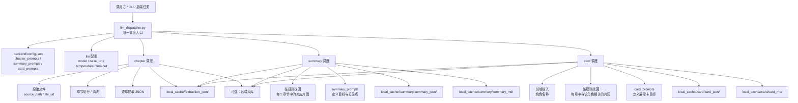
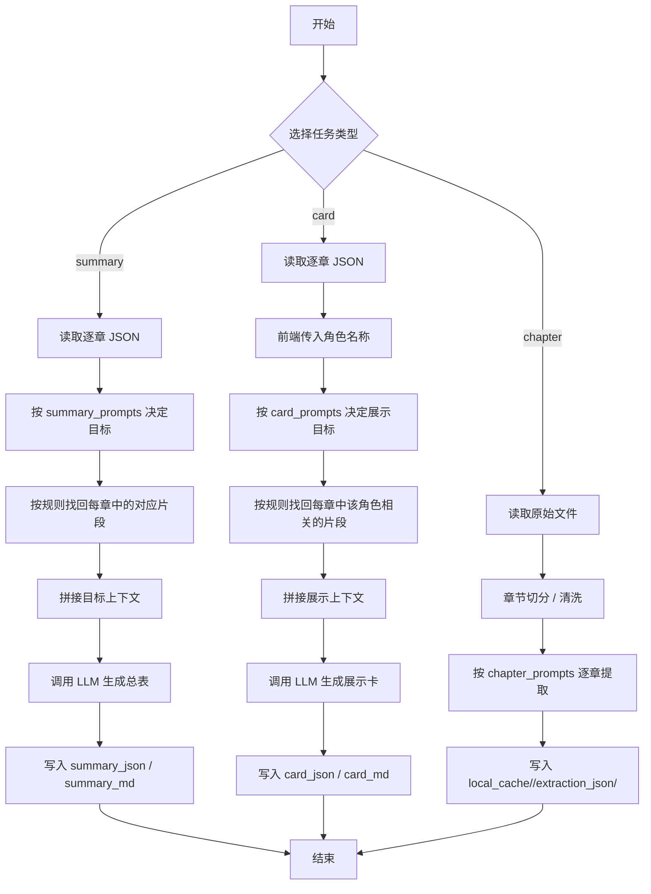
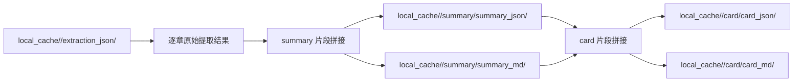

# CharPick LLM 调度模块职责图与流程图

本文档只讲一件事：**独立 LLM 调度模块到底负责什么，以及 chapter / summary / card 三条链路是怎么跑起来的。**

核心原则：**所有语义变化都由 prompt 控制，代码只负责调度、按规则找回每章中的对应片段、拼接上下文、执行模型调用和落盘。**

## 1. 模块职责图

### 职责说明

#### 1.1 `llm_dispatcher.py`

统一调度入口，负责：

- 读取配置。
- 选择任务类型。
- 组织输入上下文。
- 调用 LLM。
- 写入 JSON / Markdown 结果。

#### 1.2 `chapter_prompts`

定义逐章抽取的目标。

它决定：

- 单章要看什么。
- 单章要抽什么字段。
- 单章结果怎么写。

#### 1.3 `summary_prompts`

定义 summary 的目标。

它不等于固定 schema，而是告诉调度器：

- 这类汇总要关注哪些主题。
- 需要从每章中找哪些片段。
- 最终要输出什么总表。

#### 1.4 `card_prompts`

定义展示卡目标。

它控制：

- 展示卡要突出什么。
- 展示卡要保留什么。
- 展示卡要怎么适配前端。

#### 1.5 片段找回层

这里的关键不是“按章节整体召回”，而是：

- 按规则找回每个章节中对应的部分。
- 例如角色总表只找角色相关片段，物品总表只找物品相关片段。
- 不把无关内容一股脑拼进 prompt。

这一步是调度逻辑，不是固定语义中间层。

## 2. 调度流程图

## 3. 三条任务链路怎么理解

### 3.1 chapter 链路

chapter 是最底层输入。

它做的是：

1. 读取原始文本。
2. 切成章节。
3. 逐章按 prompt 提取。
4. 把结果落到 `extraction_json`。

这里的重点是“逐章提取”，不是 summary。

### 3.2 summary 链路

summary 不应该直接把所有章节全文硬塞给模型。

它应该做的是：

1. 读取逐章 JSON。
2. 依据 `summary_prompts` 判断当前任务要关注什么。
3. 按规则找回每章中相关片段。
4. 只拼接这些片段形成上下文。
5. 让模型生成整书总表。

这里的关键是：

- 不是“按章节召回”。
- 而是“按章节中的对应片段召回”。

### 3.3 card 链路

card 是面向前端展示的最后一步。

它通常会：

1. 读取逐章 JSON。
2. 前端传入要制作卡片的角色名称。
3. 依据 `card_prompts` 决定展示重点。
4. 找回每章中与该角色相关的片段。
5. 拼接成展示上下文。
6. 输出更适合前端消费的卡片内容。

## 4. 目录职责图

## 5. 关键约束

- 不要把 prompt 当成固定 schema。
- 不要把中间层做成硬编码的统一语义层。
- 不要全量拼接所有章节 JSON。
- 要按规则找回每个章节中的相关片段。
- 要保留原始 JSON，便于后续个性化扩展。

## 6. 适合后续扩展的方式

如果后面要做更细的任务，不需要重做架构，只需要新增 prompt 族，例如：

- `character_growth_prompts`
- `relationship_prompts`
- `artifact_evolution_prompts`
- `scene_atmosphere_prompts`

调度器仍然保持同样的职责：

- 读数据。
- 找片段。
- 拼上下文。
- 调模型。
- 落文件。

---

如果你要，我下一步可以继续把这份文档改成“更像项目设计评审稿”的样式，再补一个更正式的模块职责表。