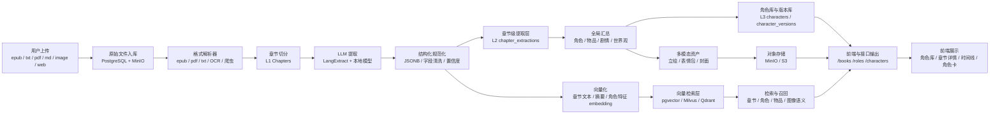
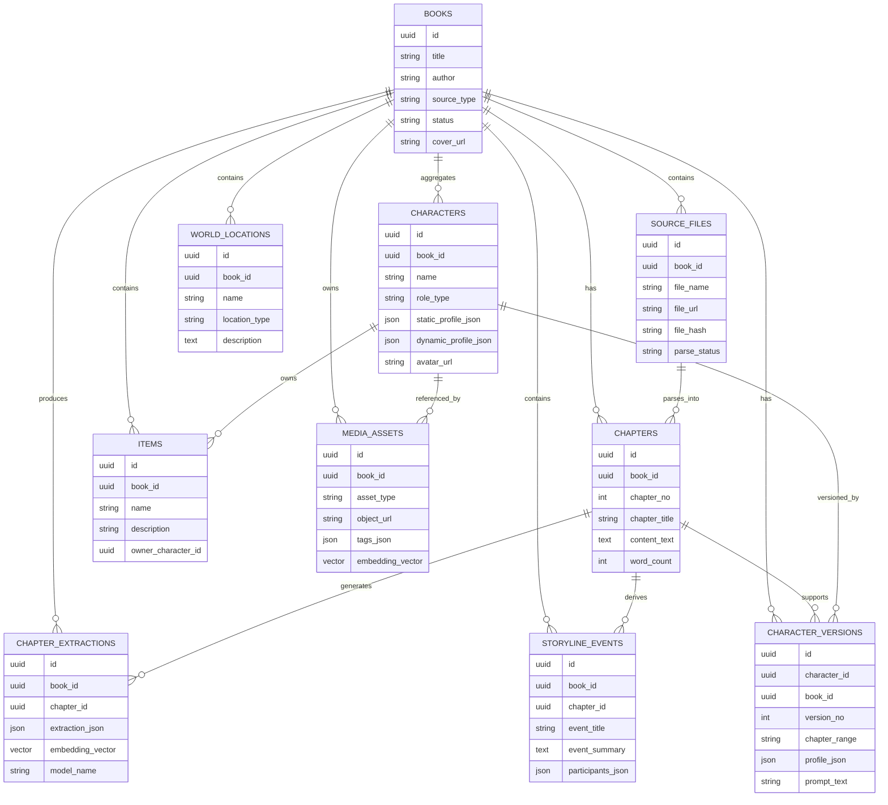
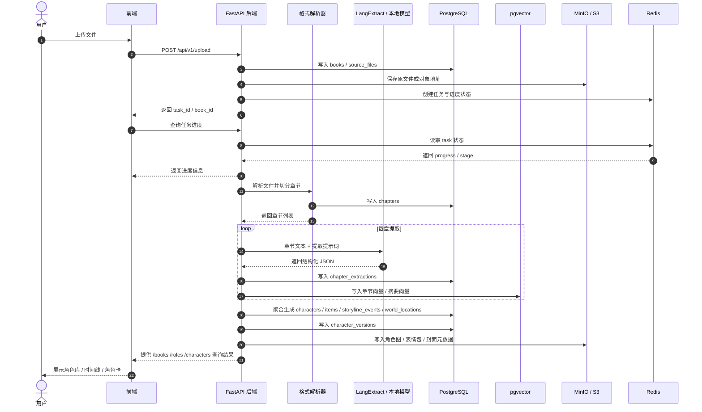

# 数据库技术实现预览

## 1. 目标

CharPick 的数据库不是单一的“角色表”，而是一个围绕“原始文件 -> 章节切分 -> 章节提取 -> 全局汇总 -> 角色库调用”的分层数据中台。

当前项目的核心目标有三个：

1. 把 epub、txt、pdf、md、图片 OCR 等来源统一落成可追溯的数据。
2. 支持按章节提取角色、剧情、地点、物品，并进一步汇总成书级角色库。
3. 为前端展示、角色卡导出、向量检索、后续生图或对话调用提供稳定的数据底座。

---

## 2. 结论先行：是否需要 MongoDB

### 结论

**不建议把 MongoDB 作为主数据库。**

更合适的方案是：

- **PostgreSQL** 作为主业务数据库
- **pgvector** 或独立向量库作为向量检索层
- **MinIO / S3** 作为文件与图片对象存储
- **Redis** 作为任务队列和进度缓存，按需要再加

### 原因

1. 你的数据不是纯文档型，而是有明显的层级关系：书籍、章节、角色、物品、剧情、世界观、角色卡版本。
2. 你需要频繁做聚合查询，比如“某书全部角色”“某角色跨章节演化”“某章节出现过哪些物品”。这类查询 PostgreSQL 更稳。
3. 你已经明确需要 JSON 化提取结果，PostgreSQL 的 JSONB 足够承载高度可变的字段。
4. 图片、表情包、立绘不应该直接塞进数据库字段，应该放对象存储，数据库只存路径、标签、来源和向量信息。

### MongoDB 适合什么情况

如果后续你想把“提取全过程 JSON”单独作为一个宽文档仓库存起来，MongoDB 也能用，但它更适合作为辅助存储，而不是核心主库。对于当前项目，MongoDB 不是必需工具。

---

## 3. 推荐总体架构

### 3.1 四层存储

| 层级     | 作用                    | 建议存储               |
| ------ | --------------------- | ------------------ |
| L0 原始层 | 原始文件、OCR 结果、导入元数据     | PostgreSQL + MinIO |
| L1 章节层 | 按章节切分后的纯文本与章节定位       | PostgreSQL         |
| L2 提取层 | 每章提取出的角色、剧情、地点、物品、时间线 | PostgreSQL JSONB   |
| L3 汇总层 | 书级角色总表、世界观总表、角色卡、动态画像 | PostgreSQL + 向量检索  |

### 3.2 资源分工

| 组件 | 作用 | 是否必需 |
| --- | --- | --- |
| PostgreSQL | 主业务库，保存书籍、章节、角色、汇总、关系 | 必需 |
| pgvector | 保存文本切片或摘要向量，用于检索 | 推荐 |
| MinIO / S3 | 保存原始文件、封面、OCR 图片、角色图、表情包 | 推荐 |
| Redis | 任务队列、进度状态、短期缓存 | 可选但强烈建议 |
| MongoDB | 宽文档存储，辅助保存完整提取 JSON | 非必需 |
| Milvus / Qdrant | 独立向量数据库 | 规模变大后再考虑 |

### 3.3 本项目的现实推荐

如果你现在要先做 MVP，建议直接上：

- PostgreSQL
- pgvector
- MinIO
- Redis

这套组合比“PostgreSQL + MongoDB + 向量库”更容易起步，也更方便后续维护。

### 3.4 数据流图

#### 读取方式

- 左侧是输入源，经过解析后先落到原始层和章节层。
- 中间是 LLM 提取和结构化规范化，生成章节级提取结果。
- 下方是向量化和检索层，用于语义召回、角色卡生成、章节回溯。
- 右侧是全局汇总层、对象存储和前端输出，保证“结构化数据”和“图片资产”分开管理。

### 3.5 数据库存储结构图

#### 读取方式

- `books` 是一切数据的起点，承载一本书的主标识。
- `source_files` 记录文件来源，`chapters` 记录章节切分结果。
- `chapter_extractions` 保存每章的结构化提取。
- `characters`、`items`、`storyline_events`、`world_locations` 是全局汇总层。
- `character_versions` 支持同一角色按章节变化生成多个版本。
- `media_assets` 统一管理立绘、表情包和封面等多模态资源。

### 3.6 接口时序图

#### 读取方式

- 先上传文件并创建任务，再由后端持续更新进度。
- 章节解析后写入 `chapters`，每章提取后写入 `chapter_extractions` 和向量层。
- 汇总阶段生成角色库、物品、剧情和世界观数据，最终供前端展示。

---

## 4. 数据分层设计

### 4.1 L0 原始层

这一层负责保存“文件从哪来、原始是什么、版本是什么”。

建议字段：

- book_id
- source_type：epub、txt、pdf、doc、md、image、web
- file_name
- file_path 或 object_url
- file_hash
- author
- title
- import_status
- created_at

如果是图片来源，需要额外保存 OCR 文本、版面分析结果、图片对象地址。

### 4.2 L1 章节层

这一层对应你接口协议里的章节解析结果，也是后续提取的最小单元。

建议字段：

- chapter_id
- book_id
- chapter_no
- chapter_title
- chapter_range
- story_time
- content_text
- word_count
- source_file_id
- parser_type

这一层要尽量保持“纯净”，不要混太多推断结果。

### 4.3 L2 提取层

这一层存的是每章提取出的结构化结果，建议使用 JSONB。

主要内容包括：

- 本章角色
- 本章关键物品
- 本章剧情事件
- 本章地点和背景
- 本章时间线
- 提取置信度与来源片段

建议额外保留：

- source_span：原文位置或片段索引
- extractor_version：提取器版本
- prompt_version：提示词版本
- model_name：使用的本地模型或远程模型

这样后续可以回溯“这一条结论是怎么来的”。

### 4.4 L3 汇总层

这一层是前端最常展示的层，也对应你接口协议里的角色总表、剧情时间线、世界观总表、角色库。

建议汇总内容：

- 角色总表
- 角色静态画像
- 角色动态画像
- 物品总表
- 剧情总表
- 地点总表
- 世界观总表
- 角色卡导出数据

---

## 5. 表结构建议

### 5.1 books

存书籍主信息。

建议字段：

- id
- title
- author
- source_type
- language
- status
- cover_url
- created_at
- updated_at

### 5.2 source_files

存上传原文件和解析前的入口。

建议字段：

- id
- book_id
- file_name
- file_url
- file_hash
- mime_type
- raw_text_url
- ocr_text_url
- parse_status

### 5.3 chapters

存章节切分结果，对应 L1。

建议字段：

- id
- book_id
- chapter_no
- chapter_title
- chapter_range
- story_time
- content_text
- word_count
- source_file_id

### 5.4 chapter_extractions

存每章抽取结果，对应 L2。

建议字段：

- id
- book_id
- chapter_id
- extractor_type
- extraction_json
- embedding_vector
- prompt_version
- model_name
- confidence

### 5.5 characters

存角色总表与角色画像，对应 L3。

建议字段：

- id
- book_id
- name
- alias
- role_type
- first_appearance_chapter_id
- static_profile_json
- dynamic_profile_json
- prompt_text
- avatar_url
- status

### 5.6 items

存关键物品。

建议字段：

- id
- book_id
- name
- description
- owner_character_id
- first_appearance_chapter_id
- item_json

### 5.7 storyline_events

存剧情事件和时间线。

建议字段：

- id
- book_id
- chapter_id
- event_title
- event_summary
- participants_json
- location_id
- event_time

### 5.8 world_locations

存地点与世界观信息。

建议字段：

- id
- book_id
- name
- description
- related_chapter_ids
- location_type

### 5.9 character_versions

用于支持你说的“按章节动态提取角色卡”。

建议字段：

- id
- character_id
- book_id
- version_no
- chapter_range
- profile_json
- prompt_text
- is_default

### 5.10 media_assets

存图片、表情包、封面、角色立绘的元数据。

建议字段：

- id
- book_id
- asset_type
- object_url
- thumbnail_url
- tags_json
- embedding_vector
- source_character_id

---

## 6. 图片和表情包怎么存

你在技术路径里问到“RAG 只能存文本吗，图片怎么办”，这里给出落地方式。

### 正确做法

1. 图片本体放在对象存储里，例如 MinIO。
2. 数据库里保存图片元数据，例如角色、表情类型、来源章节、标签。
3. 如果要检索图片语义，可以额外保存 CLIP 向量或图片描述向量。

### 适合你的表情包方案

- angry
- happy
- neutral
- sad

建议不要先做“固定死的表情包库”，而是做“角色视觉资产 + 情绪标签 + 源章节映射”。
这样后续如果你接 Stable Diffusion、ControlNet、IP-Adapter，仍然可以复用同一套元数据。

---

## 7. 与现有接口的对应关系

你的接口协议已经很清楚了，数据库建议按下面的方式承接。

| 接口 | 对应落表 |
| --- | --- |
| POST /api/v1/upload | source_files、books |
| GET /api/v1/task/{task_id} | tasks、task_logs 或 Redis |
| POST /api/v1/extract | chapter_extractions、characters |
| GET /api/v1/books | books |
| GET /api/v1/books/{book_id}/roles | characters、character_versions |
| GET /api/v1/books/{book_id}/items | items |
| GET /api/v1/books/{book_id}/storyline | storyline_events |
| GET /api/v1/books/{book_id}/world | world_locations、worldview_summary |
| GET /api/v1/characters | characters |
| GET /api/v1/characters/{char_id} | characters、character_versions |

---

## 8. 和当前代码的衔接方式

你现在的后端已经在做这几件事：

- 章节切分
- 调用本地模型提取 JSON
- 生成 embedding
- 写入 jsonl

下一步只需要把 jsonl 的落盘，替换成数据库写入。

推荐迁移顺序：

1. 先把 books、source_files、chapters、chapter_extractions 四张核心表建出来。
2. 再把当前 jsonl 输出同步改成入库。
3. 最后补 characters、items、storyline_events、world_locations、character_versions。

这样改动最小，风险也最低。

---

## 9. 当前阶段建议使用的工具

### 必需工具

- PostgreSQL：主业务库
- MinIO：文件和图片存储
- Python + FastAPI：后端接口
- Docker：本地环境统一部署

### 推荐工具

- pgvector：向量检索
- Redis：任务调度与进度状态
- SQLAlchemy / Alembic：数据库建模和迁移

### 暂不必强上

- MongoDB：除非后续你明确想用它做“完整提取文档仓库”
- Milvus：除非数据量明显上来、pgvector 已经不够用
- 复杂消息队列：当前阶段 Redis 足够

---

## 10. MVP 实施顺序

建议按这个顺序推进：

1. 建 PostgreSQL 基础表。
2. 接 MinIO，存原始文件和图片。
3. 把现有 jsonl 输出改为入库。
4. 增加章节级提取表和书级汇总表。
5. 再接向量检索和角色卡版本管理。

---

## 11. 结论

如果目标是先把 CharPick 做成一个可用的数据库中台，**不需要先上 MongoDB**。

更稳妥的落地方案是：

- PostgreSQL 管结构化数据
- JSONB 管可变提取结果
- pgvector 管文本与语义向量
- MinIO 管图片和原始文件
- Redis 管任务与进度

这套组合已经足够覆盖你现在的章节提取、角色库、剧情汇总、表情包与后续多模态扩展需求。